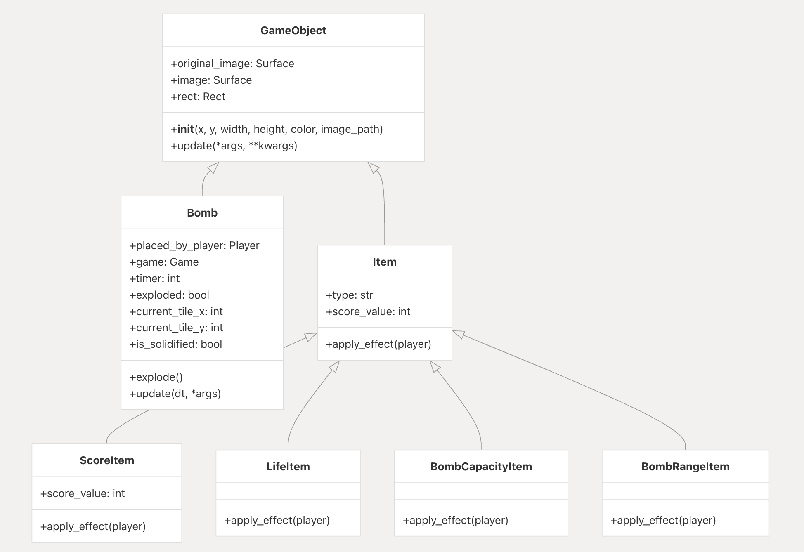
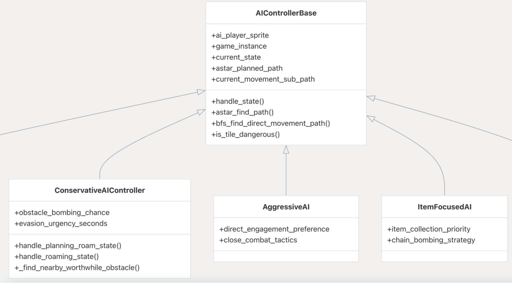
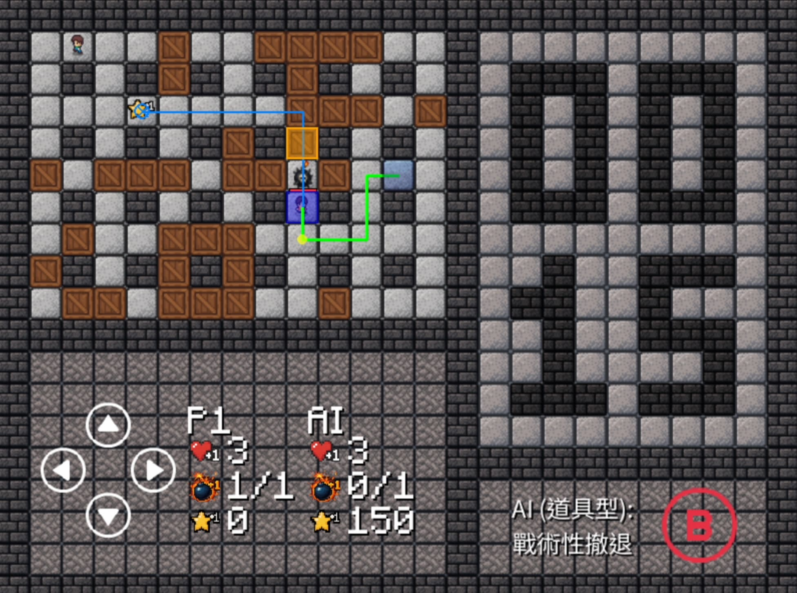
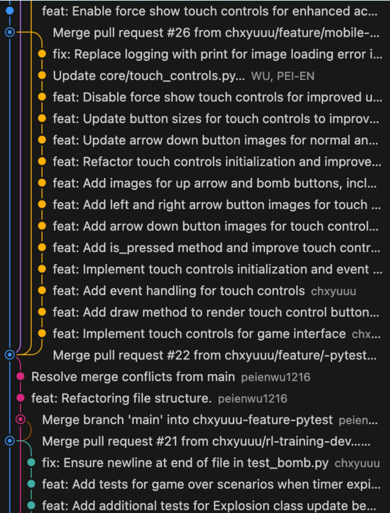
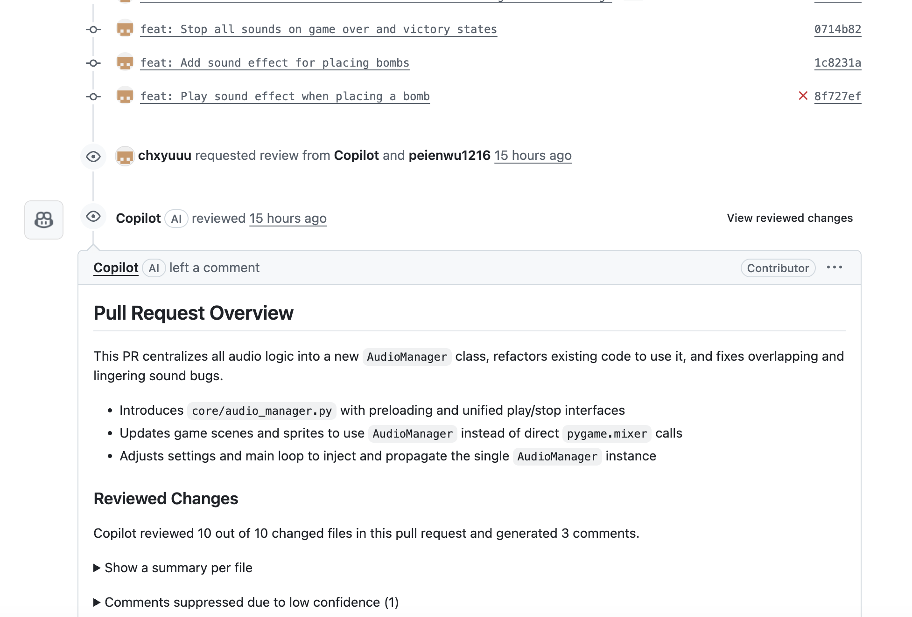
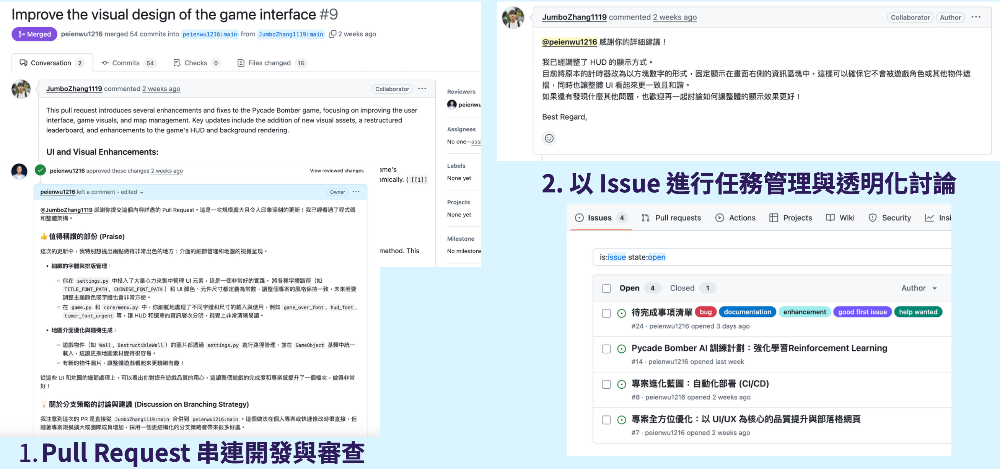
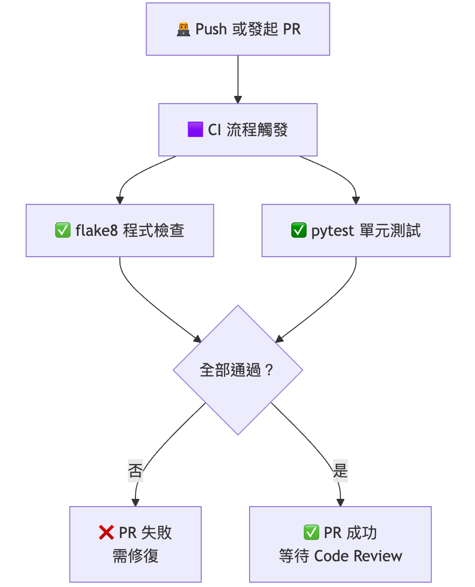
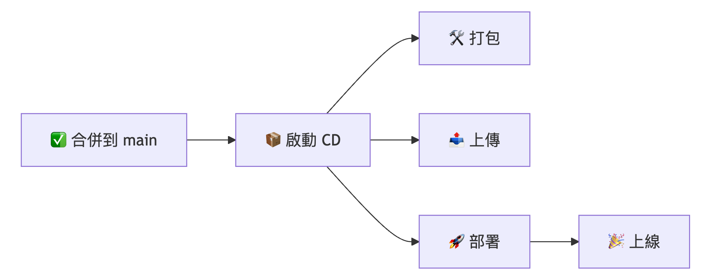

# Pycade Bomber：用 Python 打造智慧 AI 與 CI/CD 開發流程的 Pygame 專案


## 1. 前言：不只是一個遊戲，更是一次軟體工程的實踐

經典遊戲《瘋狂炸彈人》承載了許多人的童年回憶，其簡單卻富有策略性的玩法至今仍讓人著迷。多年前，我們團隊曾以 C++ 打造了一個文字介面的版本，奠定了對遊戲邏輯與 AI 設計的初步理解。然而，我們並不滿足於此。

為了追求更豐富的視覺體驗、更智慧的 AI 對手，以及更**貼近業界標準的開發流程**，我們決定啟動 **Pycade Bomber** 專案——一次從零開始，使用 Python 與 Pygame 的現代化重構。

這篇文章將不僅僅是展示遊戲成果，更是一份詳細的開發日誌。我們將深入拆解專案背後的三大核心：

1.  **穩健的物件導向架構 (OOP)**：如何打造一個易於維護與擴充的遊戲世界。
2.  **多策略的智慧 AI (FSM)**：如何設計出擁有多種「個性」、會思考、懂戰術的 AI 對手。
3.  **業界級的自動化流程 (CI/CD)**：如何透過自動化測試與部署，確保程式碼品質並能一鍵發佈。

在開始之前，何不先親身體驗一下？

> **👉 馬上試玩：** [Pycade Bomber 線上遊戲連結](https://peienwu1216.github.io/oop-2025-proj-pycade/)
> **👉 查看原始碼：** [GitHub 專案連結](https://github.com/peienwu1216/oop-2025-proj-pycade)

**技術棧 (Tech Stack)**: `Python`, `Pygame`, `Object-Oriented Programming (OOP)`, `Finite State Machine (FSM)`, `A* Search`, `Git`, `GitHub Actions (CI/CD)`, `Pytest`, `flake8`

## 2. 專案的藍圖：穩健的物件導向架構

一個好的遊戲，底層必然有一個穩健的架構。隨著專案規模擴大（我們的專案超過 5,000 行程式碼），混亂的結構會導致開發效率低落與無盡的 bug。為此，我們在專案初期就導入了物件導向程式設計 (OOP) 的核心思想，並透過以下幾個方面來實踐：

### 2.1 關注點分離 (Separation of Concerns)

我們將專案的不同職責，劃分到獨立的模組中，讓每個部分都專心做好自己的事。

* `core/`：負責遊戲的核心運作邏輯，例如場景管理 (`menu.py`)、AI 控制器 (`ai_*.py`)、資源管理器 (`audio_manager.py`) 等。
* `sprites/`：定義所有遊戲中看得到的實體物件，例如玩家 (`player.py`)、炸彈 (`bomb.py`)、牆壁 (`wall.py`) 等。
* `assets/`：存放所有靜態資源，包含圖片、音效、字體和地圖資料。
* `test/`：存放所有使用 Pytest 編寫的單元測試，確保每個模組的正確性。




點此查看更完整詳盡的 [Class Diagram](https://github.com/peienwu1216/oop-2025-proj-pycade/blob/main/ARCHITECTURE.md)

此外，我們將所有全域設定（如顏色、速度、視窗尺寸）集中在 `settings.py`中管理，避免了『魔法數字』(Magic Numbers) 的出現，讓專案配置一目了然。

### 2.2 封裝的力量 (Encapsulation)

「封裝」是將複雜的內部實作「包裝」起來，只對外提供簡單易用的操作介面。 `AudioManager` 是這個理念的最佳範例。

主程式 (`game.py`) 不需要知道 `pygame.mixer` 如何初始化、如何載入音效檔案、如何管理音軌。它只需要呼叫一個簡單的方法：

```python
# 在 game.py 中，呼叫就是這麼簡單
self.audio_manager.play_sound('explosion')
```
所有複雜的細節都被隱藏在 `AudioManager` 內部。未來若要更換音效引擎，也只需要修改這個類別，完全不會影響到主程式的任何一行程式碼。

```python
# core/audio_manager.py
import pygame

class AudioManager:
    def __init__(self):
        pygame.mixer.init()
        # 預先載入少量、常用的音效
        self.sounds = {
            'explosion': pygame.mixer.Sound('assets/audio/explosion.wav'),
            'place_bomb': pygame.mixer.Sound('assets/audio/place_bomb.wav')
        }

    def play_sound(self, name):
        if name in self.sounds:
            self.sounds[name].play()
```

### 2.3 繼承與策略模式 (Inheritance & Strategy Pattern)

我們透過「繼承」來建立通用的物件樣板，減少重複的程式碼。例如，`Player`、`Wall`、`Item` 等所有遊戲物件都繼承自一個通用的 `GameObject` 類別，共享 `image` 和 `rect` 等基本屬性。


但更進一步，我們運用了「策略模式」來設計 AI 的多種「個性」。

我們首先定義了一個 `AIControllerBase` 作為所有 AI 都必須遵守的通用介面（策略的抽象）。接著，`AggressiveAIController`、`ConservativeAIController` 等子類別各自繼承此介面，並發展出獨特的頂層目標（具體的策略實現）。



這種設計的最大好處是「高內聚、低耦合」。遊戲主體不需要關心 AI 的內部決策邏輯，只需要在遊戲開始前，像插拔卡帶一樣，將指定的 AI 控制器「安裝」到角色上即可。這使得新增或修改 AI 行為變得非常容易，而不會影響到遊戲的其他部分。

## 3. AI 的靈魂：多策略 FSM 決策系統

如果說穩健的架構是專案的骨架，那麼智慧的 AI 則是專案的靈魂。我們的目標是創造出不像機器人、懂得審時度勢、甚至會設下陷阱的對手。為此，我們融合了幾種核心技術，打造出 AI 的決策大腦。

### 3.1 有限狀態機 (FSM) - AI 的決策大腦

我們為每個 AI 導入了「有限狀態機」(Finite State Machine, FSM)。這相當於 AI 的決策中樞，它會根據當前的戰場局勢，在不同的「狀態」之間進行切換，從而做出最合適的行為。

例如，AI 的核心狀態包括：
* **`EVADING_DANGER`**：最高優先級。當偵測到自己位於炸彈的爆炸範圍內時，拋下一切任務，立刻尋找安全路徑逃離。
* **`TACTICAL_RETREAT_AND_WAIT`**：放置炸彈後，不呆在原地，而是戰術性地撤退到安全位置，等待爆炸成果。
* **`PLANNING_ITEM_TARGET`**：搜尋地圖上的道具，規劃路徑去拾取以增強自身實力。
* **`ENGAGING_PLAYER`**：主動追擊玩家，並試圖在適當的位置放置炸彈進行攻擊。
* **`ENDGAME_HUNT`**：終局模式。當地圖上的障礙物被清空時，AI 會變得極具攻擊性，對玩家展開最終狩獵（針對道具型模式）。


### 3.2 智慧尋路演算法 (A* / BFS) - AI 的行動指引

當 FSM 決定了「目標」（要去哪裡）之後，AI 需要一條聰明的路徑來達成目標，而不是一頭撞上牆。為此，我們在 AI 內部實作了 A\* 與 BFS 兩種經典的路徑規劃演算法。

* **A\* 演算法**：用於計算前往遠距離目標（如玩家或特定道具）的最佳路徑，它會綜合考慮已走過的路徑成本與到終點的預估成本。
* **BFS 演算法**：用於尋找鄰近最快可達的目標，它不考慮成本，只求以最少步數到達，非常適合用於戰術性的快速移動，例如逃離危險。

在我們的實作中，我們選擇了最經典且高效的方式來實現這兩種演算法：

* 對於 **BFS**，我們利用 Python 的 `collections.deque` 作為佇列 (Queue)，它提供了高效的 append 和 popleft 操作。我們透過一個 `visited` 集合 (Set) 來記錄已訪問過的節點，以避免在圖中走回頭路或陷入無限迴圈。

* 對於 **A\***，其核心在於它的評估函數 $f(n) = g(n) + h(n)$。我們使用了一個**優先佇列 (Priority Queue)** 來存放待探索的節點，確保每次都能選出 $f(n)$ 值最小的節點進行探索。其中：
    * $g(n)$ 是從起點到目前節點的實際移動成本（步數）。
    * $h(n)$ 是我們設計的**啟發函數 (Heuristic Function)**，我們採用了「**曼哈頓距離 (Manhattan Distance)**」，因為在我們這種只能上下左右移動的網格地圖中，它能非常快速且準確地估計到終點的距離。

我們根據任務的不同，來決定使用哪種演算法——需要快速找到鄰近安全點時用 BFS，需要規劃長遠的攻擊或奪寶路徑時用 A\*。這種針對性的選擇，是我們在專案中對演算法效率與場景應用的 **權衡（Trade-off）** 與實踐。

為了讓玩家能更直觀地感受到 AI 的「思考」，我們在遊戲畫面的右下角即時顯示出 AI 當前的狀態。如圖所示，當 AI 玩家鎖定場上的道具後，會使用 A* 演算法尋找一條成本最低的路徑，並且在放置炸彈清除障礙物後，使用 BFS 尋找鄰近的安全撤退位置，並切換到「**戰術性撤退**」狀態躲避並等待炸彈爆炸。





### 3.3 AI 的多種「個性」

為了提升遊戲的重玩價值與挑戰性，我們設計了多種不同行為模式的 AI 對手，玩家可以在主選單自由選擇。 

| AI 類型 | 主要行為模式 | 特點 |
| :--- | :--- | :--- |
| **道具型** | 專注於獲取道具，強化自身 | 在遊戲前期會優先吃道具，等裝備成形後轉為攻擊性，最具挑戰性。 |
| **攻擊型** | 積極追擊和攻擊玩家 | 以消滅玩家為最主要目標，會想盡辦法將玩家逼入死角。 |
| **保守型** | 行為謹慎，優先自保 | 會盡量避開交火區，在安全的狀況下才放置炸彈，較容易對付。 |
| **標準型** | 基礎的 AI 行為模式 | 行為較均衡，也是我們最先開發的模型（基本款）。是玩家熟悉遊戲機制的最佳練習對象。 |

## 4. 實踐業界標準的開發與協作流程

一個成功的專案，不僅仰賴優雅的程式碼，更仰賴一套清晰、高效且可靠的開發與協作流程。我們參照業界標準，建立了結合「人工智慧」與「自動化」的完整管線，確保從開發、審查到最終部署的每一步都在掌控之中。這讓我們與其他課程專案最大的不同之處。

### 4.1 分支管理策略 (Branching Strategy)

為了保護 `main` 分支（代表了隨時可以部署的「正式版」）的絕對穩定，我們採用了以下策略：

* **禁止直接提交 (No Direct Push)**：協作者不能直接將程式碼推送到 `main` 分支。
* **功能分支 (Feature Branch)**：每當要開發一個新功能 (如 `feature/new-item`) 或修復一個錯誤 (如 `fix/bomb-bug`)，都必須從最新的 `main` 分支建立一個新的獨立分支。所有開發工作都在這個獨立的分支上進行，與主線完全隔離，確保不會影響到正式版的穩定性。




### 4.2 合併請求與程式碼審查 (Pull Request & Code Review)

當一個功能分支開發完成後，開發者會發起一個「合併請求」 (Pull Request, PR)，這是一個正式的「請求合併」的申請，也是我們團隊進行集體智慧品質把關的核心環節。

* **沒有經過審查的程式碼，就沒有資格被合併**：這是我們的核心原則。PR 會通知團隊的其他成員進行程式碼審查 (Code Review)。
* **審查重點**：審查者會關注邏輯正確性、程式碼品質、可維護性，並提出修改建議。
* **善用 AI 工具**：我們也善用 AI 工具 (如 GitHub Copilot) 進行初步的 Code Review，它可以快速找出一些潛在問題，分擔人類審查者的部分工作。

透過這個流程，我們確保每一行合併進主分支的程式碼，都經過了至少一位「人類智慧」和一位「人工智慧」的雙重檢驗。



### 4.3 溝通與任務管理：交付可追溯的開發歷程
除了制定規則與導入工具，我們相信清晰、可追溯的溝通是專案成功的基石。

* **以 Pull Request 作為討論的載體**：我們不僅利用 PR 進行程式碼審查，更將其作為一個公開的技術討論區。所有針對程式碼的建議、權衡與決策過程，都被完整地記錄下來，成為專案歷史的一部分。
* **以 Issues 進行系統化任務管理**：我們使用 GitHub Issues 來管理專案的待辦事項，包括功能開發、Bug 修復與未來規劃。這讓團隊成員對專案的進程有共同的認知，也讓整個開發歷愈變得透明且有條理。




### 4.4 持續整合 (CI) - 自動化的品質守門員

在人工審查的基礎上，我們還有一位不知疲倦的「自動化守門員」。當 PR 被發起時，GitHub Actions 會自動執行兩道主要的品質檢測：

1.  **程式碼檢查 (flake8)**：`Python`風格與品質檢查，捕捉潛在語法問題。
2.  **單元功能測試 (Pytest)**：執行所有單元測試，確保新功能沒有破壞舊功能。

只有當人工審查和自動化測試都通過後，程式碼才被允許合併。


我們為專案的關鍵核心邏輯編寫了單元測試，主要涵蓋：

* **關鍵業務邏輯 (Business Logic)**：驗證 Player 受創後的生命週期、Bomb 的狀態轉換、Item 的效果應用等核心遊戲規則。
* **資料持久化 (Data Persistence)**：確保 LeaderboardManager 對於分數的讀寫與排序邏輯準確無誤。
* **邊界條件 (Edge Cases)**：測試諸如生命值為零、炸彈數量達到上限等極端情況下的系統行為。

這些測試如同我們的「**安全網**」。在我們不斷新增功能或重構程式碼時，它能立刻捕捉到因修改而產生的意外錯誤 (Regression)，讓我們可以更有信心地進行開發迭代，確保了專案的長期穩定性。



### 4.5 持續部署 (CD) - 一鍵發佈到全世界

當程式碼成功合併到 `main` 分支後，持續部署流程會自動觸發。GitHub Actions 會自動將專案打包成網頁版本，並發佈到 GitHub Pages。這意味著每一次成功的合併，玩家就能在幾分鐘內玩到最新的遊戲版本，而我們完全不需要手動介入。


當程式碼成功合併到 `main` 分支後，部署流程會自動觸發。其流程如下圖所示：



GitHub Actions 會自動將專案打包成網頁版本，並將遊戲發佈到網頁。

## 5. 技術挑戰與解決方案

所有成功的專案都不是一帆風順的，真正的學習往往發生在克服困難的過程中。在這裡，我們想分享幾個在開發 Pycade Bomber 時遇到的具體挑戰，以及我們是如何解決它們的。

### 5.1 AI 震盪之謎：狀態切換與遺失的路徑

在開發初期，我們遇到了AI 設計中一個非常經典的問題：行為震盪 (Oscillation)。

* **遇到的問題**：AI 玩家在某些情況下會「卡住」，在原地微微顫抖，似乎在兩個目標或兩個狀態之間猶豫不決，無法執行任何有效的移動。
* **除錯過程**：為了解決這個問題，我們為 AI 設計了一套詳細的日誌系統 (`ai_log`)，用來追蹤每一幀 (frame) AI 的狀態變化、決策過程以及路徑規劃的結果。透過分析大量的日誌，我們發現了一個奇怪的模式：AI 的路徑規劃函式確實成功計算並設定了一條有效的移動路徑，但幾乎在同一時間，當 AI 準備執行移動時，那條路徑卻又神秘地變成了空的。
* **根本原因**：在追蹤程式碼後，我們終於找到了「兇手」——問題出在 `AIControllerBase` 類別的 `change_state` 函式中。我們最初的設計是，為了確保狀態切換的純粹性，每一次呼叫 `change_state` 時，都會無條件地將 AI 的當前移動路徑 (`self.current_movement_sub_path`) 清空。這導致了致命的連鎖反應：一個「規劃」狀態（如 `PLANNING_ITEM_TARGET`）辛辛苦苦計算出的路徑，在它呼叫 `change_state` 切換到「執行」狀態（如 `MOVING_TO_COLLECT_ITEM`）的瞬間，就被 `change_state` 函式本身給清空了。AI 進入移動狀態後，發現無路可走，只好再次重新規劃，陷入了「規劃->清空->規劃」的死循環。

為了解決這個問題，我們重構了 `change_state` 函式。以下是修改前後的程式碼對比：

**修改前 (有問題的版本)**
```python
# ai_controller_base.py
# 在 change_state 函式中，無條件清空路徑
def change_state(self, new_state):
    if self.current_state != new_state:
        # ... (更新狀態與時間)
        self.current_state = new_state
        self.state_start_time = pygame.time.get_ticks()

        # 問題點：不論新狀態是什麼，都直接清空路徑！
        self.current_movement_sub_path = [] 
        self.current_movement_sub_path_index = 0
        # ...
```
**修改後 (解決方案)**
```python
# ai_controller_base.py
# 修改後的 change_state 函式
def change_state(self, new_state):
    if self.current_state != new_state:
        # ... (更新狀態與時間)
        self.current_state = new_state
        self.state_start_time = pygame.time.get_ticks()

        # --- 解決方案 ---
        # 只有在進入需要「重新規劃」的特定狀態時，才清空路徑。
        # 這能避免剛設定好的路徑，在切換到「執行」狀態時被意外清除。
        if new_state.startswith("PLANNING_") or new_state in ["IDLE", "DEAD"]:
            self.current_movement_sub_path = []
            self.current_movement_sub_path_index = 0
        
        # ... (其他狀態清理邏輯) ...
```

這個除錯過程讓我們深刻體會到，在複雜的狀態機設計中，狀態轉換時的「副作用管理」是多麼重要。一個看似無害的清理動作，如果沒有考慮到上下文，就可能導致難以追查的邏輯錯誤。

### 5.2 瀏覽器音訊的陷阱：解決 Web 環境的自動播放限制

將 Pygame 專案透過 `pygbag` 部署到網頁上，雖然能讓玩家方便地體驗，但也帶來了許多 Web 環境獨有的挑戰，其中最典型的就是音訊播放問題。

* **遇到的問題**：我們的遊戲在桌面版上音效一切正常，但部署到 Web 之後，一打開遊戲頁面，就會看到一個 `MEDIA USER ACTION REQUIRED` 的錯誤訊息，導致遊戲完全沒有聲音，尤其在手機瀏覽器上這個問題幾乎必然發生。

* **原因探究**：經過研究我們了解到，這是現代瀏覽器為了提升使用者體驗而設下的「**自動播放政策 (Autoplay Policy)**」。為了防止惡意網站一打開就自動播放惱人的廣告或音樂，瀏覽器規定，任何音訊的播放（甚至包括音訊系統的初始化 `pygame.mixer.init()`)，都必須在使用者對頁面進行了**首次「互動」（例如點擊、觸控）之後**才能執行。我們原本的程式在遊戲一載入時就初始化了音訊系統，因此直接觸發了這個限制。

* **解決方案**：我們的策略是「**延遲初始化**」。我們不再於遊戲啟動時立刻載入主遊戲場景，而是設計了一個全新的 `StartScene` (開始畫面) 作為遊戲的入口，並在 `main.py` 中實作了一個簡單的場景管理迴圈。

    1.  **建立入口場景**：遊戲從 `StartScene` 開始，它的唯一任務，就是顯示一個簡單的「點擊畫面以開始遊戲」的提示。
    2.  **等待使用者互動**：程式會停在這個畫面，直到偵測到使用者的第一次滑鼠點擊或螢幕觸控。
    3.  **互動後才初始化**：在接收到使用者的互動事件後，`StartScene` 會結束，並回傳下一個場景（`Menu`）的實例。在此之後，核心的 `AudioManager` 才能被安全地使用。

以下是 `main.py` 中主遊戲迴圈的簡化版，清晰地展示了這個流程：

```python
# main.py

async def main():
	# ... (省略了 pygame 初始化與螢幕設定) ...

	# 建立唯一的 AudioManager 實例
	audio_manager = AudioManager()

	# 遊戲從 StartScene 開始，此時尚未播放音訊
	current_scene = StartScene(screen, audio_manager, clock)

	running_main_loop = True
	while running_main_loop:
		events = pygame.event.get()
		# ... (處理 QUIT 事件) ...

		# current_scene.update() 會處理該場景的邏輯，
		# 並在需要切換時，回傳下一個場景的實例
		next_scene_candidate = current_scene.update(events, dt)

		# 如果回傳的不是當前場景，就進行切換
		if next_scene_candidate is not current_scene:
			current_scene = next_scene_candidate

		# ... (處理繪圖與迴圈結束邏輯) ...

	pygame.quit()

if __name__ == '__main__':
	asyncio.run(main())
```

這個「先互動，後載入」的流程，完美地繞過了瀏覽器的自動播放限制，確保了音訊系統能被合法啟動。這個經驗讓我們學到，將應用程式從一個平台移植到另一個平台時，必須充分考慮目標平台的獨特規範與限制，而不僅僅是程式碼本身的邏輯。這是一個典型的「在我的電腦上可以跑」(It works on my machine) 問題的 Web 版本，而解決它的過程讓我們獲益良多。

## 6. 總結與未來展望

從一個 C++ 的文字遊戲，到一個功能完整、部署在網頁上的 Pycade Bomber，這趟重構之旅讓我們收穫頗豐。這不僅僅是一次技術的升級，更是一次開發思維的全面進化。

我們成功地：
* **打造了穩健的軟體架構**：透過物件導向與設計模式，讓專案的擴充與維護變得輕鬆。
* **實現了多策略的智慧 AI**：結合 FSM 與路徑規劃，創造出懂得思考、行為多樣的遊戲對手。
* **建立了專業的開發流程**：導入 CI/CD 自動化管線，從此告別手動測試與部署的繁瑣，向業界標準看齊。

這個專案最終不僅僅是一個可以玩的遊戲，更是我們團隊在軟體工程領域上，從設計、開發、測試到交付的完整實踐。

### 未來展望 (Future Work)

Pycade Bomber 的世界還有廣闊的探索空間，我們規劃了幾個令人興奮的未來方向：

* **在【遊戲性】方面** ：
    * **網路連線對戰**：實現真正的多人線上對戰，這是 Bomberman 類型遊戲的靈魂！ 
    * **更多元的遊戲內容**：設計更多樣化的地圖、特色道具與陷阱，甚至加入強大的 Boss 關卡。 
    * **關卡編輯器**：讓玩家可以自行設計地圖，上傳並分享，實現使用者生成內容 (UGC)。 

* **在【技術深度】方面** ：
    * **強化學習 (Reinforcement Learning)**：在現有的 AI 基礎上，引入強化學習模型進行訓練，讓 AI 能自主學習出更頂尖的遊戲策略。 
    * **效能與視覺優化**：優化渲染效能，並加入更精美的粒子特效與角色動畫，提升整體的視覺體驗。 
    * **跨平台支援**：將遊戲打包成桌面應用程式 (Windows/macOS)，而不僅限於網頁。

### 歡迎您的貢獻！(We Welcome Contributions!)

Pycade Bomber 是一個充滿熱情的專案，我們也非常歡迎有同樣熱情的您加入社群，一同讓它變得更好！

* 如果您發現了任何 Bug 或有新的功能想法，歡迎到我們的 [**GitHub Issues**](https://github.com/peienwu1216/oop-2025-proj-pycade/issues) 頁面提出。
* 如果您希望直接貢獻程式碼，請先閱讀我們的[**貢獻指南 (CONTRIBUTING.md)**](https://github.com/peienwu1216/oop-2025-proj-pycade/blob/main/CONTRIBUTING.md)，並隨時發起 Pull Request。
* 我們也標示了一些適合新手入門的 [**Good First Issues**](https://github.com/peienwu1216/oop-2025-proj-pycade/labels/good%20first%20issue)，如果您想小試身手，從這裡開始是個不錯的選擇！

感謝您的閱讀！希望這篇文章能為正在學習 Python 遊戲開發或對軟體工程實踐感興趣的您帶來一些啟發。

如果您還沒玩過，不妨點擊下方連結，挑戰一下我們精心設計的 AI 吧！

> **👉 馬上試玩：** [Pycade Bomber 線上遊戲連結](https://peienwu1216.github.io/oop-2025-proj-pycade/)
> **👉 查看原始碼：** [GitHub 專案連結](https://github.com/peienwu1216/oop-2025-proj-pycade)
